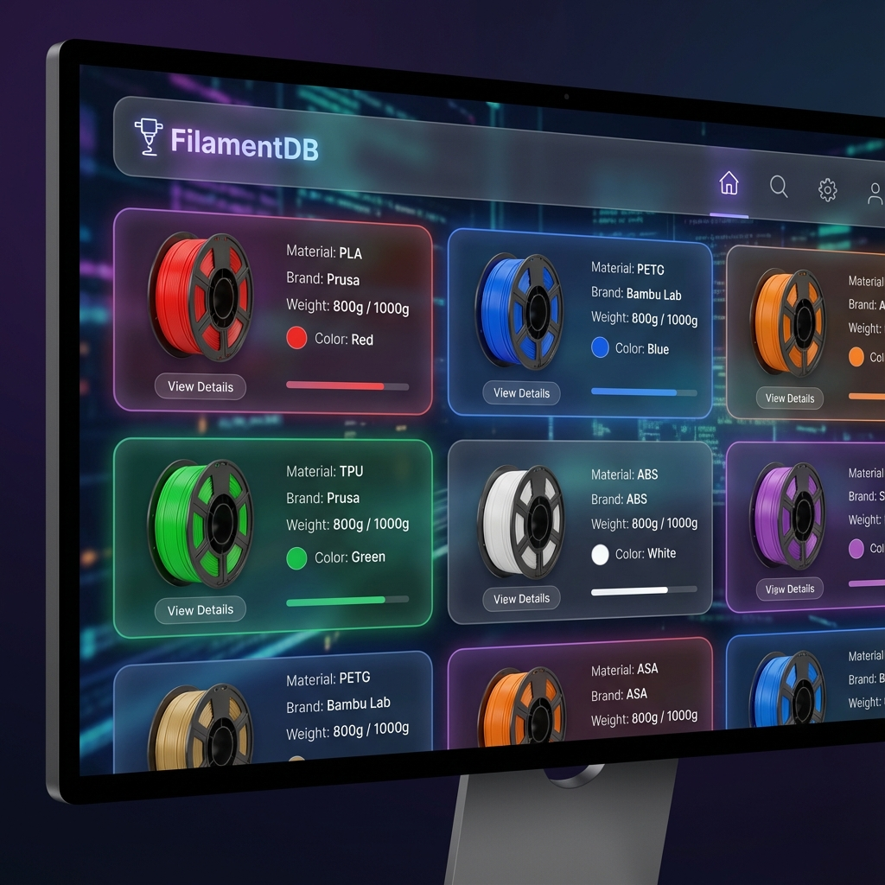
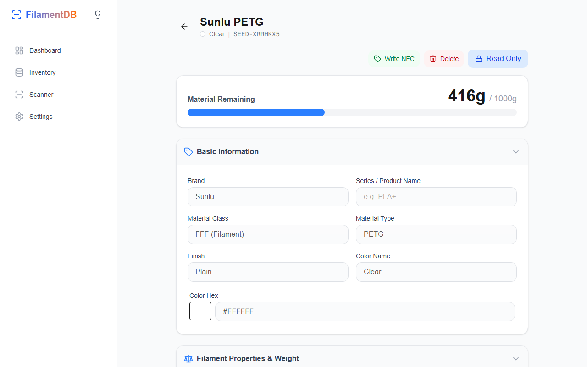
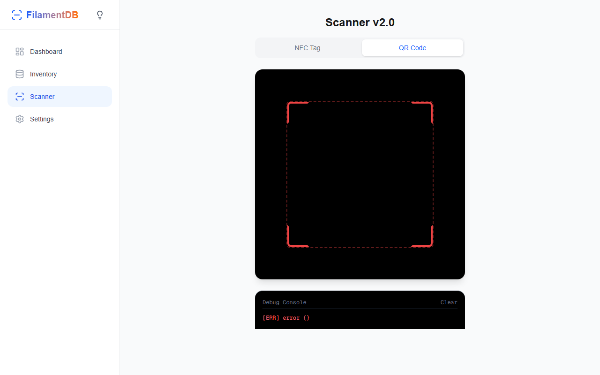

# 🎨 FilamentDB

> **A modern, local-first 3D printer filament inventory management system with NFC scanning support**

FilamentDB is a progressive web application (PWA) and Android app designed to help 3D printing enthusiasts track their filament inventory effortlessly. With support for NFC tag scanning, barcode/QR code reading, and URL-based metadata extraction, managing your filament spools has never been easier.

---

## ✨ Features

### 📱 **Cross-Platform**
- **Progressive Web App (PWA)**: Works seamlessly in any modern browser
- **Android App**: Native mobile experience via Capacitor
- **Offline-First**: All data stored locally in human-readable JSON files
- **File-Based Storage**: Each spool stored as an individual JSON file for easy backup and git tracking
- **Multi-Device Sync**: Simplified timestamp-based sync across unlimited devices

### 🏷️ **Smart Data Entry**
- **NFC Tag Scanning**: Tap compatible NFC tags (e.g., OpenPrintTag) to instantly read filament data
- **QR Code/Barcode Scanner**: Import filament information from product codes
- **URL Metadata Extraction**: Paste a product URL and automatically extract brand, material, and color
- **Manual Entry**: Full-featured form for manual spool addition

### 📊 **Inventory Management**
- **Visual Dashboard**: See your entire filament collection at a glance
- **Weight Tracking**: Monitor total and remaining filament weight with visual indicators
- **Color-Coded Cards**: Instantly identify spools by their actual filament color
- **Filtering & Search**: Quickly find spools by material type, brand, or color
- **Grouped View**: View spools grouped by brand, type, and color with aggregated statistics
- **Empty Spool Management**: Toggle visibility of empty spools with visual distinction
- **Edit & Delete**: Update spool information or remove consumed filaments

### 🎯 **Additional Capabilities**
- **Material Types**: Support for PLA, PETG, TPU, ABS, ASA, Nylon, and more
- **Diameter Options**: Track both 1.75mm and 2.85mm filaments
- **Purchase History**: Record purchase dates and organize inventory chronologically
- **Light/Dark Mode**: Toggle between themes with persistent preference
- **Micro-Animations**: Smooth transitions and professional UI polish
- **Easy Backup**: Simple folder copy for complete backup
- **Git-Friendly**: Track individual spool changes in version control
- **Comprehensive Testing**: 30+ unit tests ensuring reliability

---

### 🛠️ **Advanced Customization**
- **Material Profiles**: Manage default density and temperatures for standard materials (PLA, ABS, PETG, etc.)
- **Dynamic Forms**: Configure Spool Profile form layout (1-5 columns) and reorder fields via drag-and-drop
- **Smart Defaults**: Auto-fill material properties from your defined profiles when creating new spools

---

## 🖼️ Screenshots

### Dashboard

*Clean, visual overview of your entire filament inventory*

### Spool Detail & Consumption

*Track usage with an interactive, editable dashboard and detailed history*

### NFC Scanning

*Tap your phone to an NFC tag and instantly load filament data*

### Material Settings

*Configure global presets for filament density and temperatures*

---

## 🚀 Quick Start

### Prerequisites
- **Node.js** 20+ and npm
- **Git**
- **(Optional)** Android SDK for building the mobile app

### Installation

1. **Clone the repository**
   ```bash
   git clone https://github.com/Pixelplanet/FilamentDB.git
   cd FilamentDB/web-app
   ```

2. **Install dependencies**
   ```bash
   npm install
   ```

3. **Run the development server**
   ```bash
   npm run dev
   ```

4. **Open your browser**
   ```
   http://localhost:3000
   ```

### Building for Production

**Web (PWA)**
```bash
npm run build
npm run start
```

**Android App**
```bash
# Build the web assets for mobile
npm run build:mobile

# Sync with Capacitor
npm run cap:sync

# Open Android Studio to build APK
# Open Android Studio to build APK
npx cap open android
```

### 🐳 Docker (Recommended)

Run FilamentDB instantly using the official Docker image:

```bash
docker run -d \
  -p 3000:3000 \
  -v ./data:/app/data \
  --name filamentdb \
  pixelplanet5/filamentdb-app:latest
```
This serves the app at `http://localhost:3000` and saves your inventory to a local `./data` folder.

---

## 🏗️ Architecture

### Tech Stack
- **Framework**: [Next.js 16](https://nextjs.org/) (App Router)
- **UI/Styling**: [Tailwind CSS 4](https://tailwindcss.com/), Lucide Icons
- **Database**: Local File System (JSON)
- **Mobile**: [Capacitor 8](https://capacitorjs.com/)
- **NFC**: [@capgo/capacitor-nfc](https://www.npmjs.com/package/@capgo/capacitor-nfc)
- **QR Scanner**: [@yudiel/react-qr-scanner](https://www.npmjs.com/package/@yudiel/react-qr-scanner)

### Project Structure
```
FilamentDB/
├── web-app/
│   ├── src/
│   │   ├── app/              # Next.js App Router pages
│   │   │   ├── page.tsx      # Dashboard
│   │   │   ├── inventory/    # Inventory management
│   │   │   ├── scan/         # NFC/QR scanning
│   │   │   ├── settings/     # App settings
│   │   │   └── api/          # API routes (sync, scraping)
│   │   ├── components/       # React components
│   │   ├── db/               # Types and Interfaces
│   │   └── hooks/            # Custom React hooks (useNFC, etc.)
│   ├── android/              # Capacitor Android project
│   ├── public/               # Static assets
│   └── scripts/              # Build scripts
└── screenshots/              # Documentation images
```

---

## 🔧 Configuration

### Environment Variables
Create a `.env.local` file in the `web-app/` directory:

```env
# Optional: Backend sync server URL
NEXT_PUBLIC_SYNC_URL=https://your-sync-server.com

# Build mode (auto-detected during build)
BUILD_MODE=pwa  # or 'mobile'
```

### Customization
- **Database Schema**: Edit `src/db/index.ts` to modify the data model
- **Supported Materials**: Update the material types in `src/app/inventory/add/page.tsx`
- **Brand List**: Customize available brands in the form component

---

## 📖 Usage

### Adding a Filament Spool

**Method 1: Manual Entry**
1. Navigate to **Inventory** → **Add New Spool**
2. Fill in the details (brand, material, color, weight, etc.)
3. Click **Save**

**Method 2: NFC Scanning**
1. Go to the **Scan** page
2. Hold your phone near an NFC tag (must contain NDEF records)
3. Review the auto-filled data and save

**Method 3: URL Import**
1. Copy a product URL (e.g., from Prusa, Bambu Lab)
2. Paste it in the **Product URL** field on the Add Spool page
3. Click **Analyze** to auto-populate fields

### Tracking Filament Usage
1. Open a spool from the inventory
2. Click **Edit**
3. Update the **Remaining Weight** slider
4. Save changes

### Syncing Across Devices
FilamentDB includes a complete sync implementation using delta synchronization:

1. **Deploy the sync server**: Run FilamentDB in Docker (includes built-in sync API)
   ```bash
   cd web-app
   docker-compose up -d
   ```
   
   > **Note**: See [DOCKER_GUIDE.md](DOCKER_GUIDE.md) for detailed Docker workflows and best practices.

2. **Configure environment variables** on the server:
   ```env
   SYNC_API_KEY=your-secure-random-key
   SYNC_DATA_DIR=/app/data
   ```

3. **On each device**:
   - Go to **Settings**
   - Enter your **Server URL** (e.g., `http://192.168.1.100:3000`)
   - Enter your **API Key** (same as server's `SYNC_API_KEY`)
   - Click **Save** then **Sync Now**

4. **Features**:
   - ✅ Simplified timestamp sync (compares file modification times)
   - ✅ Last-Write-Wins conflict resolution
   - ✅ Works across unlimited devices
   - ✅ File-based storage (your data, your server)
   - ✅ API key authentication
   - ✅ Push/pull capabilities for manual control

See [ENV_VARIABLES.md](ENV_VARIABLES.md) for detailed setup instructions.

---

## 🧪 Testing

The project uses [Vitest](https://vitest.dev/) for unit testing:

```bash
# Run tests
npm run test

# Run tests in watch mode
npm run test -- --watch
```

Current test coverage includes:
- NFC data parsing logic (`useNFC.test.ts`)
- URL scraping utilities (`api/scrape/scrape.test.ts`)

---

## 📋 Roadmap

See [improvement_roadmap.md](improvement_roadmap.md) for a detailed technical roadmap. 

**→ For developers**: See [IMPLEMENTATION_GUIDE.md](IMPLEMENTATION_GUIDE.md) for step-by-step instructions on implementing these features.

### ✅ Recently Completed

#### Phase 1: Stability & Safety
- [x] **Comprehensive test coverage** - 30 unit tests for database operations (96.7% pass rate)
- [x] **Fix NFC listener memory leaks** - Proper cleanup and event listener management
- [x] **Improve error handling** - Robust NFC/Camera permission handling

#### Phase 2: Performance & Sync
- [x] **Delta-based synchronization** - Only sync changed data for efficiency
- [x] **Conflict resolution** - Last-Write-Wins strategy for multi-device sync
- [x] **Database schema v3** - Added `lastUpdated` and sync tracking fields
- [x] **SyncManager implementation** - Complete client-side sync logic
- [x] **Server-side sync API** - File-based storage with API key authentication

#### Phase 3: UI/UX & Features
- [x] **Framer Motion animations** - Page transitions and staggered list animations
- [x] **Design system** - CSS variables, utility classes, and consistent styling
- [x] **Theme toggle** - Light/dark mode with localStorage persistence
- [x] **Improved metadata display** - Null safety and fallback values
- [x] **Enhanced URL analyzer** - Better visual feedback and loading states
- [x] **Grouped filament view** - View spools grouped by brand, type, and color
- [x] **Empty spool management** - Toggle visibility with visual distinction

#### Phase 4: File-Based Storage Migration (Complete!)
- [x] **Storage abstraction layer** - Platform-agnostic storage interface
- [x] **File-based backend** - Individual JSON files per spool
- [x] **Complete API implementation** - RESTful endpoints for all operations
- [x] **Migration tools** - UI and scripts to convert from IndexedDB
- [x] **Simplified sync** - Timestamp-based file sync (replaces complex delta sync)
- [x] **Human-readable format** - Pretty-printed JSON for easy inspection
- [x] **Docker deployment** - Updated image with new storage system

### 🔄 In Progress

- [ ] End-to-end tests with Playwright
- [ ] PWA manifest optimization
- [x] Service worker for offline functionality
- [x] Mobile storage fallback (runs on Android using web storage bridge)

### 🎯 Future Improvements

#### Core Features
- [ ] Advanced filtering (by date, purchase history, location)
- [ ] Print history integration (track which spools were used for which prints)
- [ ] Support for resin/powder materials
- [ ] Batch operations (bulk edits)
- [ ] Search indexing for faster queries with large datasets

#### Analytics & Insights
- [ ] Usage statistics and trends
- [ ] Cost tracking per print
- [ ] Low stock alerts and notifications
- [ ] Print planning (estimate spool usage)

#### Integrations
- [ ] OctoPrint/Klipper integration
- [ ] PrusaLink/PrusaSlicer integration
- [ ] Export to CSV/Excel
- [ ] API for third-party tools


---

## 🤝 Contributing

Contributions are welcome! Please follow these guidelines:

1. **Fork the repository**
2. **Create a feature branch**: `git checkout -b feature/amazing-feature`
3. **Commit your changes**: `git commit -m 'Add amazing feature'`
4. **Push to the branch**: `git push origin feature/amazing-feature`
5. **Open a Pull Request**

### Development Guidelines
- Follow the existing code style (ESLint configuration)
- Write tests for new features
- Update documentation as needed
- Ensure the app builds without errors

### For Maintainers
- See [RELEASE_GUIDE.md](RELEASE_GUIDE.md) for detailed release procedures
- Includes critical file naming constraints and version management

---

## 📄 License

This project is licensed under the **MIT License** - see the [LICENSE](LICENSE) file for details.

---

## 🙏 Acknowledgments

- **OpenPrintTag** community for NFC tag standards
- **Capacitor Team** for the amazing cross-platform framework
- **Prusa Research** and **Bambu Lab** for inspiring the URL scraping feature

---

## 📞 Support

- **Issues**: [GitHub Issues](https://github.com/Pixelplanet/FilamentDB/issues)
- **Discussions**: [GitHub Discussions](https://github.com/Pixelplanet/FilamentDB/discussions)

---

## 🌟 Star History

If you find this project useful, please consider giving it a ⭐ on GitHub!

---

**Made with ❤️ for the 3D printing community**
